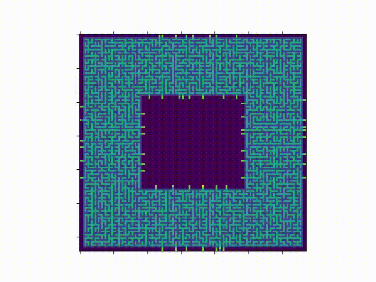

# Advent of code 2019
## Solution for the advent of code problems 2019
In each subdir there is solution, input and sometimes a more pretty solution

## Day 1: The Tyranny of the Rocket Equation
#### Part 1:
calculate fuel for modules

#### Part 2:
calculate the fuel for added fuel

## Day 2: 1202 Program Alarm
#### Part 1:
Get the output from intcode computer with 1202 input alarm

#### Part 2:
Find the input combination of noun and verb that gives specific output

## Day 3: Crossed Wires
#### Part 1:
Find the nearest intersection between two crossed wires from the outlet

#### Part 2:
Find the combined shortest path of the two wires to an intersection

## Day 4: Secure Container
#### Part 1:
Get the number of possible password given the set of rules for a password

#### Part 2:
Added rule about two adjecent digits cant be part of bigger chunk.

## Day 5: Sunny with a Chance of Asteroids
#### Part 1:
Expand intcode computer from day 2 to support opcode 3(input), opcode 4(ouput) and different parameter modes

#### Part 2:
Extend the computer with new operation codes: less, jump if true, jump if false and equals

## Day 6: Universal Orbit Map
#### Part 1:
Find the number of direct and indirect orbits based on a input. A tree structure where e.g. A orbits B and B orbits C .. meaning A indirectly orbits C

#### Part 2:
Find the shortest path between yourself and santa using orbital transfers

## Day 7: Amplification Circuit
#### Part 1:
Find the maximum output from 5 amplifiers(intcoders) connect together based on permutations. output from A goes to input in B etc..

#### Part 2:
Loop the output from last amplifier to the first, and run untill all exits by a code 99 and get the largets output

## Day 8: Space Image Format
#### Part 1:
Find the number of twos and ones in the pixel layer with fewest zeros

#### Part 2:
Decode the message by stacking layers on top. transparrent if 2

## Day 9: Sensor Boost
#### Part 1:
Extend the intcode computer to handle relative parameter mode, pluss opcode 9(set relative base). Also new features such as larger memory then initial program.

#### Part 2:
Test with other input values to computer

## Day 10: Monitoring Station
#### Part 1:
Find the location to build the monitoring station that is able to observe the most astroids from one place.

#### Part 2:
Calculate The destruction order of a laser beam fired from the monitoring station.

## Day 11: Space Police
#### Part 1:
Build a robot moving on a grid painting either black or white. Color and movement is based on output from intcode computer.

#### Part 2:
Change the starting field to white and fetch crypted message inside the paint.

## Day 12: The N-body problem
#### Part 1:
Get the total energy in the system after 100 iterations
#### Part 2:
Get the number of steps before the state of the system repeats itself.

## Day 13: Care Package
#### Part 1:
Intcode program draws blocks, walls, ball and paddle. How many blocks are there?

#### Part 2:
Part 2 is to play the game(spoiler; it is breakout).

## Day 14: Space Stoichiometry
#### Part 1:
given a list of reactions between stuff find the number of ORE needed to get 1 FUEL unit

#### Part 2:
If we have 1 trillion ORE how much fuel can we make, given the same reactions?

## Day 15: Oxygen System
#### Part 1:
Find the shortest path from the starting position of the repaire droid to the broken oxygen tank

#### Part 2:
The oxygen is filling the roooms. Get the number of timesteps before everything is filled

## Day 16: Flawed Frequency Transmission
#### Part 1:
Calculate output for each phase based on rules and input list. What is the 8 first digits after 100 phases?

#### Part 2:
Multiply the input times 10000 and do the same. Brute force wont work. Have to be smart.

## Day 17: Set and Forget
#### Part 1:
Vacuum bot moving outside the ship on scaffolds. get the number of intersections of scaffolds. 

#### Part 2:
get the path the bot has to take to cover everything. Must på compressed into Main, A, B, C. Intcode program has limit of 20 chars.

## Day 18: Many-Worlds Interpretation
#### Part 1:
Find all the keys in the maze in the shortest possible way. Need keys to go passed doors to get other keys

#### Part 2:
Find all the keys, except there are 4 robots working in each own section of the maze

## Day 19: Tractor Beam
#### Part 1:
How many points are affected by the tractor beam in a 50x50 area

#### Part 2:
Get the index of the 100x100 tractor beam square closest to the emitter

## Day 20: Donut Maze
#### Part 1:
Find the shortest path through the donut/portal maze

#### Part 2:
Each time you jump through a portal on the inside level incresase, and decrease when on the outside. Find the shortest path through were the target needs to be on level 0

## Day 21: Springdroid Adventure
#### Part 1:
Write spring script so that the droid gets pass without falling in holes

#### Part 2:
Extended the view of the droid. Need to write more advanced springscript

## Day 22: Slam Shuffle
#### Part 1:
Shuffle the cards according to rules and get the position of card 2019

#### Part 2:
Shuffles according to same rules and do this 1 gazillion times with a larger deck and get the value on 2020

## Day 23: Category six
#### Part 1:
Create a network of intcode machines the ping each other and get the first message sent to address 255

#### Part 2:
Change 255 address to NAT and get the first restart signal that is the same in a row sent from NAT to unit 0

## Day 24: Planet of Discord
#### Part 1:
Game of life.. Get the biodiv of the map after N iterations of the game.

#### Part 2:
Multilevel game of life.. Not yet done

