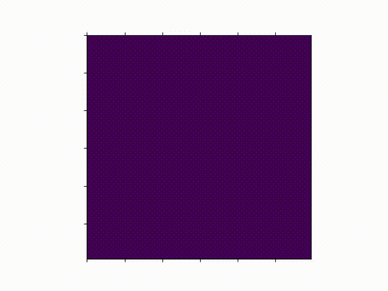

# Day 19: Tractor Beam

Unsure of the state of Santa's ship, you borrowed the tractor beam technology from Triton. Time to test it out.

When you're safely away from anything else, you activate the tractor beam, but nothing happens. It's hard to tell whether it's working if there's nothing to use it on. Fortunately, your ship's drone system can be configured to deploy a drone to specific coordinates and then check whether it's being pulled. There's even an Intcode program (your puzzle input) that gives you access to the drone system.

The program uses two input instructions to request the X and Y position to which the drone should be deployed. Negative numbers are invalid and will confuse the drone; all numbers should be zero or positive.

Then, the program will output whether the drone is stationary (0) or being pulled by something (1). For example, the coordinate X=0, Y=0 is directly in front of the tractor beam emitter, so the drone control program will always report 1 at that location.

To better understand the tractor beam, it is important to get a good picture of the beam itself. For example, suppose you scan the 10x10 grid of points closest to the emitter:

           X
      0->      9
     0#.........
     |.#........
     v..##......
      ...###....
      ....###...
    Y .....####.
      ......####
      ......####
      .......###
     9........##

In this example, the number of points affected by the tractor beam in the 10x10 area closest to the emitter is 27.

### However, you'll need to scan a larger area to understand the shape of the beam. How many points are affected by the tractor beam in the 50x50 area closest to the emitter? (For each of X and Y, this will be 0 through 49.)

Your puzzle answer was 213.
## Part Two

You aren't sure how large Santa's ship is. You aren't even sure if you'll need to use this thing on Santa's ship, but it doesn't hurt to be prepared. You figure Santa's ship might fit in a 100x100 square.

The beam gets wider as it travels away from the emitter; you'll need to be a minimum distance away to fit a square of that size into the beam fully. (Don't rotate the square; it should be aligned to the same axes as the drone grid.)

For example, suppose you have the following tractor beam readings:

    #.......................................
    .#......................................
    ..##....................................
    ...###..................................
    ....###.................................
    .....####...............................
    ......#####.............................
    ......######............................
    .......#######..........................
    ........########........................
    .........#########......................
    ..........#########.....................
    ...........##########...................
    ...........############.................
    ............############................
    .............#############..............
    ..............##############............
    ...............###############..........
    ................###############.........
    ................#################.......
    .................########OOOOOOOOOO.....
    ..................#######OOOOOOOOOO#....
    ...................######OOOOOOOOOO###..
    ....................#####OOOOOOOOOO#####
    .....................####OOOOOOOOOO#####
    .....................####OOOOOOOOOO#####
    ......................###OOOOOOOOOO#####
    .......................##OOOOOOOOOO#####
    ........................#OOOOOOOOOO#####
    .........................OOOOOOOOOO#####
    ..........................##############
    ..........................##############
    ...........................#############
    ............................############
    .............................###########

In this example, the 10x10 square closest to the emitter that fits entirely within the tractor beam has been marked O. Within it, the point closest to the emitter (the only highlighted O) is at X=25, Y=20.

### Find the 100x100 square closest to the emitter that fits entirely within the tractor beam; within that square, find the point closest to the emitter. What value do you get if you take that point's X coordinate, multiply it by 10000, then add the point's Y coordinate? (In the example above, this would be 250020.)

Your puzzle answer was 7830987.
